<div align="center">

# bhtunnel

### Quantum simulation of black-hole greybody factors and Hawking emission

[](https://github.com/hastikacheddy/bhtunnel/actions/workflows/tests.yml)
[](LICENSE)
[](pyproject.toml)
[](https://www.ibm.com/quantum/qiskit)

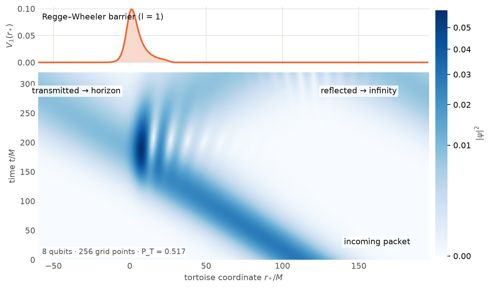

<sub>An <i>l</i> = 1 wave packet, simulated on 8 qubits, hits the black hole's potential barrier
and splits: part tunnels toward the horizon, the rest reflects to infinity.</sub>

</div>

---

A wave escaping a black hole must tunnel through the **Regge–Wheeler barrier**
that surrounds it. The fraction that gets through, the **greybody factor**
$`\Gamma_l(\omega)`$, is what turns Hawking's ideal blackbody into the spectrum a
black hole actually emits.

`bhtunnel` encodes this scattering problem on qubits. It builds a quantum
algorithm for $`\Gamma_l(\omega)`$ and measures, link by link, what it costs to run
on simulators and on IBM hardware. Alongside the physics it covers:

- an end-to-end error budget,
- a gate-cost study,
- noise and error-mitigation experiments,
- an amplitude-estimation analysis for the tunnelling tail,
- a VQE treatment of massive-scalar quasi-bound states.

> **Scope in one line.** This is a 1-D problem a laptop solves exactly. The project
> is a quantitative study of *what a quantum simulation of it costs and where it
> breaks*, not a claim of quantum advantage.

## Contents

- [Highlights](#highlights)
- [Physics background](#physics-background)
- [Quantum algorithm](#quantum-algorithm)
- [Results](#results)
- [Interactive demo](#interactive-demo)
- [Getting started](#getting-started)
- [Repository structure](#repository-structure)
- [Scope and limitations](#scope-and-limitations)
- [Roadmap](#roadmap)
- [Citing](#citing)

## Highlights

| | Result |
|---|---|
| **Classical reference** | Exact $`\Gamma_l`$ solver; total scalar Hawking power **7.437 × 10⁻⁵ M⁻²** (literature: 7.44 × 10⁻⁵) |
| **Algorithm** | Split-operator circuit on $`2^n`$ grid points; **one qubit** reads out the transmission |
| **Accuracy (simulator)** | $`\lvert\Delta P_T\rvert \approx 4\times10^{-3}`$ on 8 qubits with 60 Trotter steps; circuit matches its classical twin to $`1-10^{-14}`$ fidelity |
| **Cost** | Exact potential costs $`2^n-2`$ CZ per step and dominates from $`n\approx 6`$; kinetic term is only $`n(n+1)/2`$ rotations |
| **Hardware scale** | 5 qubits, 2 steps = **390 CZ** on IBM Heron; readout mitigation + ZNE recovers 0.715 vs. ideal 0.756 (raw 0.571) |
| **Amplitude estimation** | Ideal speed-up 35–112× in the tail, but only above per-oracle fidelity λ ≈ 0.63–0.93; measured λ ≈ 0.28–0.48 |
| **VQE (massive scalar)** | 2p quasi-bound state on 5 qubits: fidelity 0.99993, $`M\omega = 0.29622`$ |

## Physics background

Units are $`G=c=\hbar=1`$ and the black-hole mass is $`M=1`$, so frequencies are the
dimensionless $`M\omega`$.

A massless field of spin $`s`$ and multipole $`l`$ on the Schwarzschild background
reduces to a one-dimensional wave equation in the tortoise coordinate:

```math
\frac{d^2\psi}{dr_*^2} + \bigl[\omega^2 - V_l(r)\bigr]\psi = 0,
\qquad
r_* = r + 2M\ln\!\left(\frac{r}{2M}-1\right),
```

```math
V_l(r) = \left(1-\frac{2M}{r}\right)\left[\frac{l(l+1)}{r^2} + \frac{2M(1-s^2)}{r^3}\right].
```

The horizon sits at $`r_*\to-\infty`$ and spatial infinity at $`r_*\to+\infty`$. A wave
sent in from infinity is partly reflected and partly absorbed:

```math
\psi \sim
\begin{cases}
e^{-i\omega r_*}, & r_*\to-\infty \ \ (\text{into the horizon}),\\[2pt]
A_\text{in}\,e^{-i\omega r_*} + A_\text{out}\,e^{+i\omega r_*}, & r_*\to+\infty,
\end{cases}
\qquad
\Gamma_l(\omega) = \frac{1}{\lvert A_\text{in}\rvert^2}.
```

The greybody factors set both the absorption cross section and the Hawking
emission rate, per degree of freedom:

```math
\sigma_\text{abs}(\omega) = \frac{\pi}{\omega^2}\sum_l (2l+1)\,\Gamma_l(\omega),
\qquad
\frac{d^2N}{dt\,d\omega} = \frac{1}{2\pi}\sum_l \frac{(2l+1)\,\Gamma_l(\omega)}{e^{\omega/T_H}-1},
\qquad
T_H = \frac{1}{8\pi M}.
```

The quantum computer only ever estimates $`\Gamma_l`$. The thermal factor is exact,
so the Hawking spectrum is classical post-processing.

## Quantum algorithm

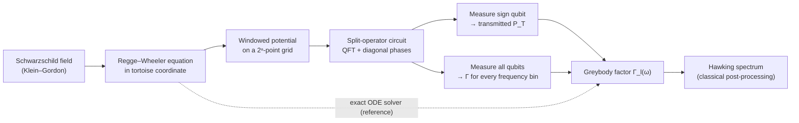

**Encoding.** $`n`$ qubits hold the wavefunction on $`N=2^n`$ points of a box in
$`r_*`$. The Hamiltonian is

```math
H = -\frac{\partial^2}{\partial r_*^2} + V_l(r_*), \qquad H\psi = \omega^2\psi,
```

so a stationary state at energy $`\omega^2`$ obeys exactly the Regge–Wheeler
equation. There is no factor of ½: the eigenvalue is $`\omega^2`$, not $`\omega^2/2`$.

**Evolution.** Each Strang step alternates a diagonal potential phase with a
kinetic phase applied in momentum space:

```math
e^{-iH\,\delta t} \approx
e^{-iV\delta t/2}\;\mathrm{QFT}\;e^{-iK\delta t}\;\mathrm{QFT}^\dagger\;e^{-iV\delta t/2},
\qquad K = \mathrm{diag}\bigl(k_m^2\bigr),\quad k_m = \frac{2\pi m'}{L}.
```

The momentum index $`m'`$ is the two's-complement value of the register, so it is
linear in the Pauli operators $`Z_q`$. As a result, $`k^2`$ contains only 1- and
2-qubit terms, and the kinetic phase costs only $`n(n+1)/2`$ rotations.

**Readout.** After a final $`\mathrm{QFT}^\dagger`$, the top qubit is the *sign of
the momentum*. An incident packet moves toward the horizon ($`k\lt 0`$), so

```math
P_T = P\bigl(q_{n-1}=1\bigr) = \frac{1-\langle Z_{n-1}\rangle}{2},
\qquad
\Gamma\bigl(\lvert k_m\rvert\bigr) = \frac{P_\text{after}(m)}{P_\text{before}(m)}\quad (k_m\lt 0).
```

A single-qubit expectation value gives the transmission. Measuring the whole
register resolves $`\Gamma`$ at every frequency in the packet from one run.

<p align="center">
  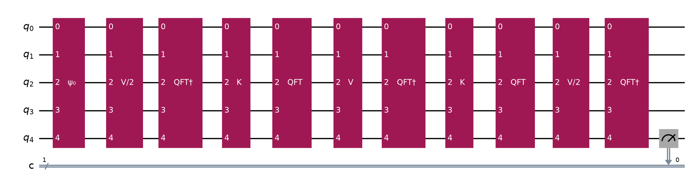
  <br><sub>The 5-qubit, 2-step circuit as it runs on hardware.
  ψ₀: packet preparation · V, V/2: potential phases · QFT†, K, QFT: kinetic phase.</sub>
</p>

Every circuit is verified gate-for-gate against a NumPy **classical twin** on the
same grid (fidelity $`1-10^{-14}`$). This splits the total error into separately
measurable links:

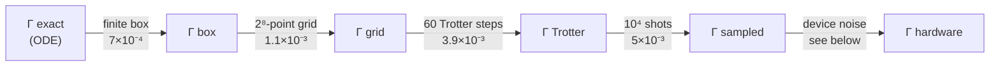

## Results

All figures are regenerated from `data/` by the scripts in [`scripts/`](scripts/).

### 1. Classical reference

The exact solver integrates from deep inside the near-horizon region, then matches onto
an asymptotic series $`e^{\pm i\omega r_*}\sum_k a_k r^{-k}`$ at large radius. That
series treats the long-range $`l(l+1)/r^2`$ tail exactly.

<p align="center">
  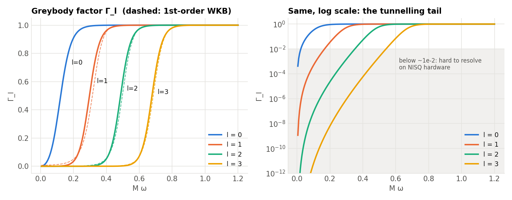
</p>
<p align="center">
  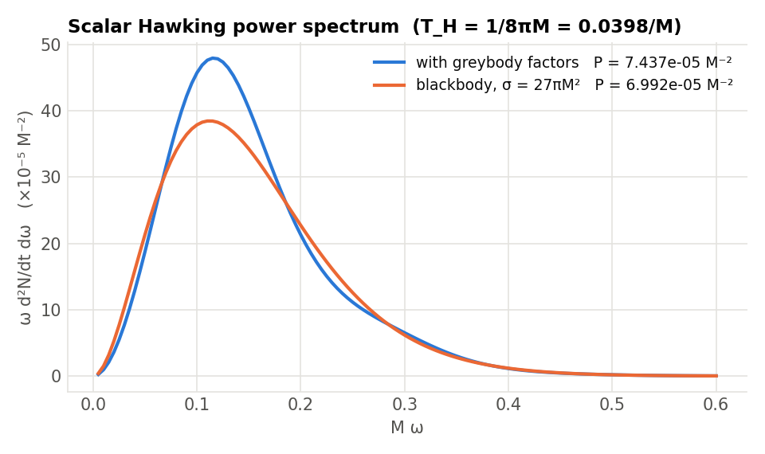
  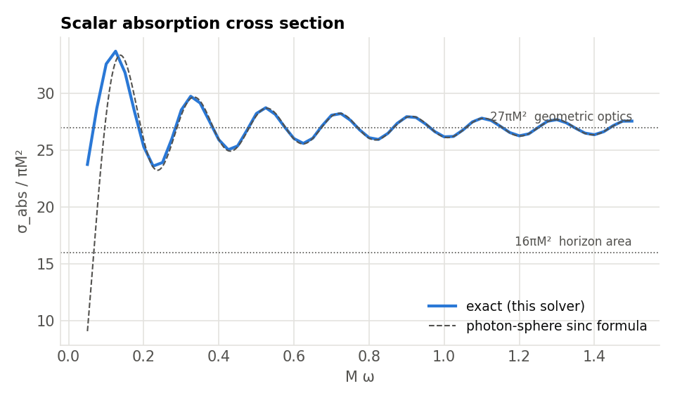
</p>

| Validation check | Result |
|---|---|
| Flux conservation $`\Gamma+\mathcal{R}=1`$ | < 10⁻⁹ (typ. 10⁻¹²) for $`s=0,1,2`$ |
| Low-frequency limit $`\sigma_\text{abs}\to16\pi M^2`$ (horizon area) | ✓ |
| High-frequency photon-sphere formula | agreement < 0.5 % for $`M\omega\ge0.8`$ |
| Total scalar Hawking power | 7.437 × 10⁻⁵ M⁻² vs. 7.44 × 10⁻⁵ |

### 2. The algorithm reproduces Γ on a simulator

<p align="center">
  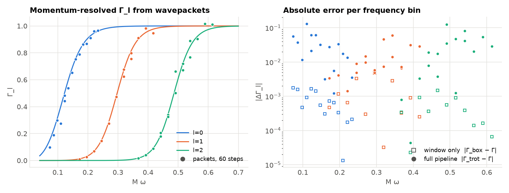
</p>

Three packets per multipole recover $`\Gamma_l(\omega)`$ across the transmission
edge. For an $`l=1`$ packet at $`M\omega\approx0.3`$ ($`P_T\approx0.52`$), the error
budget is:

| Link | $`\lvert\Delta P_T\rvert`$ |
|---|---|
| Finite box (window $`r_*\in[-25,30]`$) | 7.0 × 10⁻⁴ |
| Grid discretisation ($`n=8`$) | 1.1 × 10⁻³ |
| Trotterisation (60 Strang steps) | 3.9 × 10⁻³ |
| Shot noise (10⁴ shots, 1σ) | 5.0 × 10⁻³ |

The finite box costs little near the barrier top, but it dominates in the
tunnelling tail. For $`l=2`$ at $`M\omega=0.1`$, cutting the window at $`r_*=30`$
changes $`\Gamma`$ by 97 %.

### 3. Resources

<p align="center">
  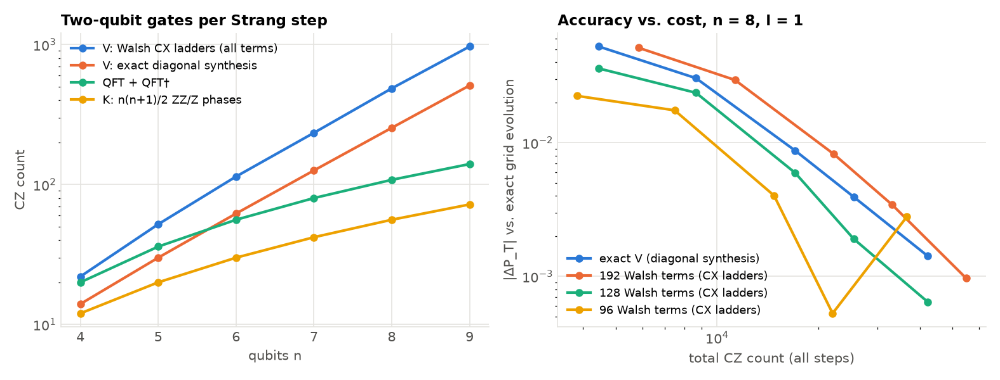
</p>

| Qubits $`n`$ | 4 | 5 | 6 | 7 | 8 | 9 |
|---|---|---|---|---|---|---|
| Potential (exact diagonal) | 14 | 30 | 62 | 126 | 254 | 510 |
| QFT + QFT† | 20 | 36 | 56 | 80 | 108 | 140 |
| Kinetic phase | 12 | 20 | 30 | 42 | 56 | 72 |

<sub>CZ gates per Strang step, transpiled all-to-all to {cz, rz, sx, x}.</sub>

A localised barrier is **not sparse in the Walsh basis**: 1 × 10⁻³ accuracy needs
about 100 of 255 terms at $`n=8`$. Exact diagonal synthesis is therefore the
default.

### 4. Noise and error mitigation

A faithful Trotterisation needs the packet to move less than a barrier width per
step. That means 8–30 steps and thousands of CZ gates, which is beyond current
devices. Hardware-scale runs (1–2 steps) are therefore **device benchmarks**: they
are scored against the classical twin *at the same step count*. Test points are
chosen with $`P_T`$ far from ½, the value a fully depolarised device returns.

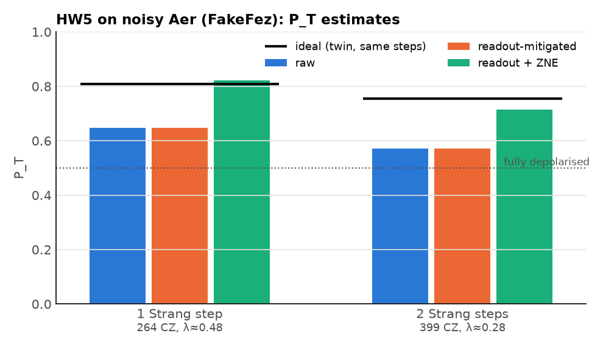

| Circuit | Twin | Raw | Readout + ZNE | λ |
|---|---|---|---|---|
| 5 qubits, 1 step (264 CZ) | 0.808 | 0.647 | **0.822** | 0.48 |
| 5 qubits, 2 steps (399 CZ) | 0.756 | 0.571 | **0.715** | 0.28 |

<sub>Noisy Aer with the IBM Fez (Heron) noise model. ZNE uses global folding
(scales 1, 3, 5) with an exponential fit. λ is the effective
depolarising survival of one application of the circuit.</sub>

<br clear="right">

### 5. Amplitude estimation for the tunnelling tail

Sampling estimates a probability $`p`$ to relative error $`\varepsilon`$ with about
$`1/(p\,\varepsilon^2)`$ shots. Maximum-likelihood amplitude estimation uses the
Grover operator $`Q = A S_0 A^\dagger S_\chi`$, for which

```math
P_m = \lambda^{2m+1}\sin^2\!\bigl((2m+1)\theta\bigr) + \frac{1-\lambda^{2m+1}}{2},
\qquad p=\sin^2\theta .
```

<p align="center">
  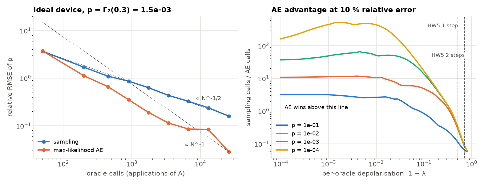
</p>

On an ideal device the method reaches $`\propto N^{-1}`$ scaling and beats sampling
by 35× at $`p=10^{-3}`$ and 112× at $`p=10^{-4}`$. Under noise it only wins above a
break-even per-oracle fidelity of **λ ≈ 0.63–0.93**, depending on $`p`$. The
measured λ ≈ 0.28–0.48 is below break-even, so on today's hardware sampling is the
better estimator. The analysis gives a concrete fidelity target for when amplitude
estimation starts to pay.

### 6. Massive scalar: where VQE fits

A scalar of mass $`\mu`$ has hydrogen-like quasi-bound states behind the barrier:

```math
\omega_n \simeq \mu\left[1-\frac{(M\mu)^2}{2n^2}\right], \qquad n = l+1+n_r .
```

A Dirichlet wall at the barrier top makes the problem Hermitian, which makes
its ground state a legitimate VQE target. For $`M\mu=0.3`$ and $`l=1`$ on 5 qubits:

<p align="center">
  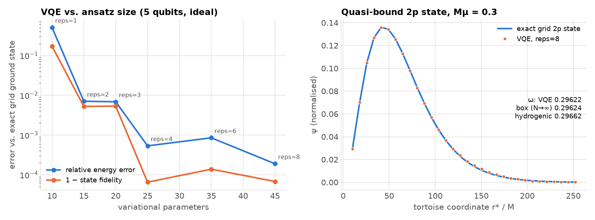
</p>

| | $`M\omega`$ |
|---|---|
| VQE (25 parameters, fidelity 0.99993) | 0.29622 |
| Exact grid ground state | 0.29622 |
| Converged box ($`N\to\infty`$) | 0.29624 |
| Hydrogenic formula | 0.29662 |

The Hamiltonian has 63 Pauli terms in 17 qubit-wise-commuting groups. The
Hermitian box gives $`\mathrm{Re}\,\omega`$ only; $`\mathrm{Im}\,\omega`$ is on the
roadmap.

## Interactive demo

A Streamlit app ([`app/`](app/)) puts the whole pipeline behind sliders. Every
number on screen is computed live or read from the exact tables.

<p align="center">
  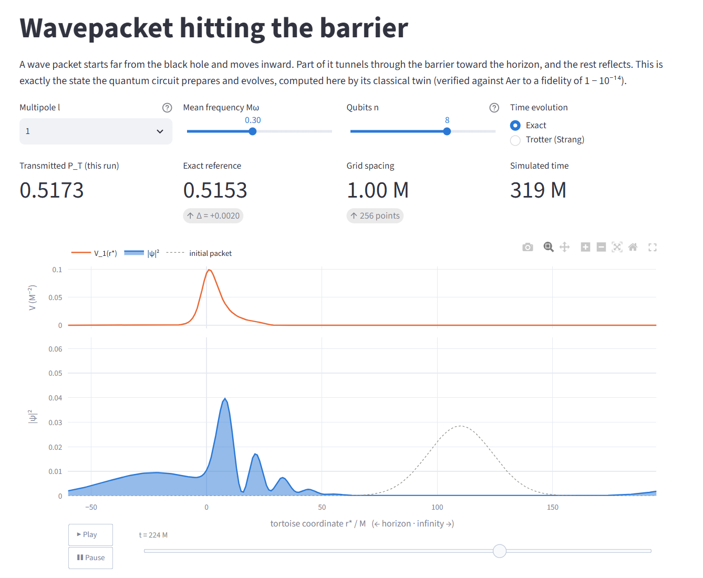<br>
  <sub><b>Wavepacket.</b> Animated scattering for any l, frequency, qubit count and Trotter
  depth, paused here just after the packet splits. Below it, Γ is resolved per frequency bin.</sub>
</p>

<table>
  <tr>
    <td width="50%">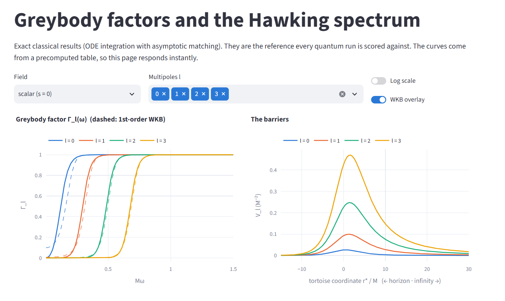<br>
      <sub><b>Greybody & Hawking.</b> Γ_l for spin 0, 1 and 2 with WKB overlay, then the
      Hawking spectrum vs. a blackbody and the absorption cross section.</sub></td>
    <td width="50%">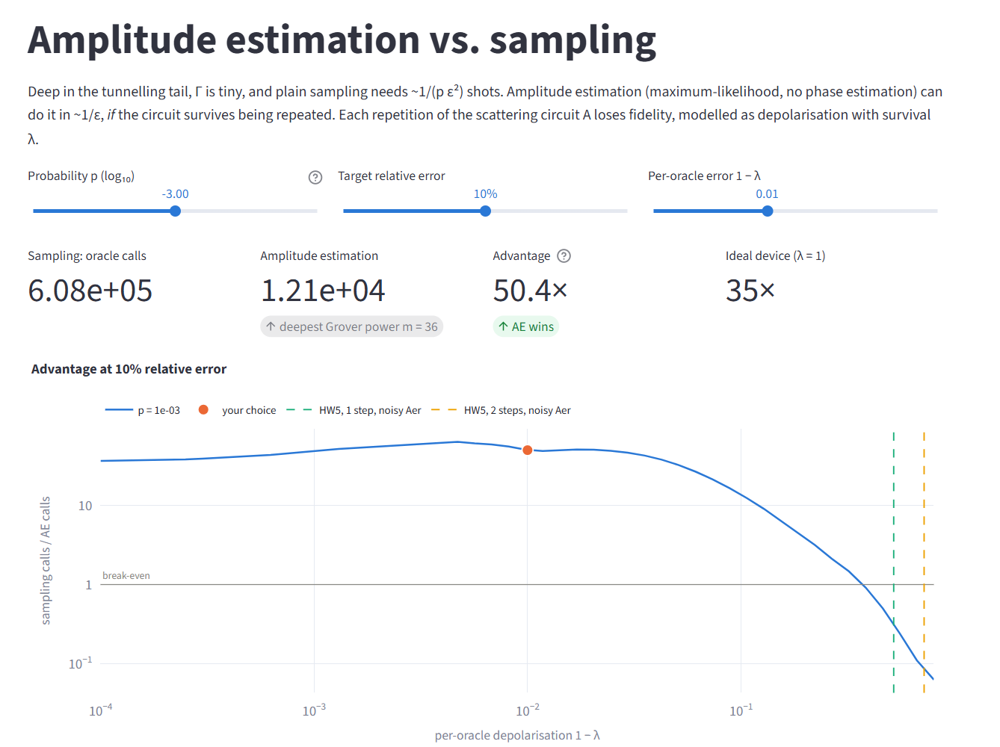<br>
      <sub><b>Amplitude estimation.</b> Advantage over sampling vs. per-oracle noise, with
      the λ measured for the hardware-scale circuit marked.</sub></td>
  </tr>
</table>

<p align="center">
  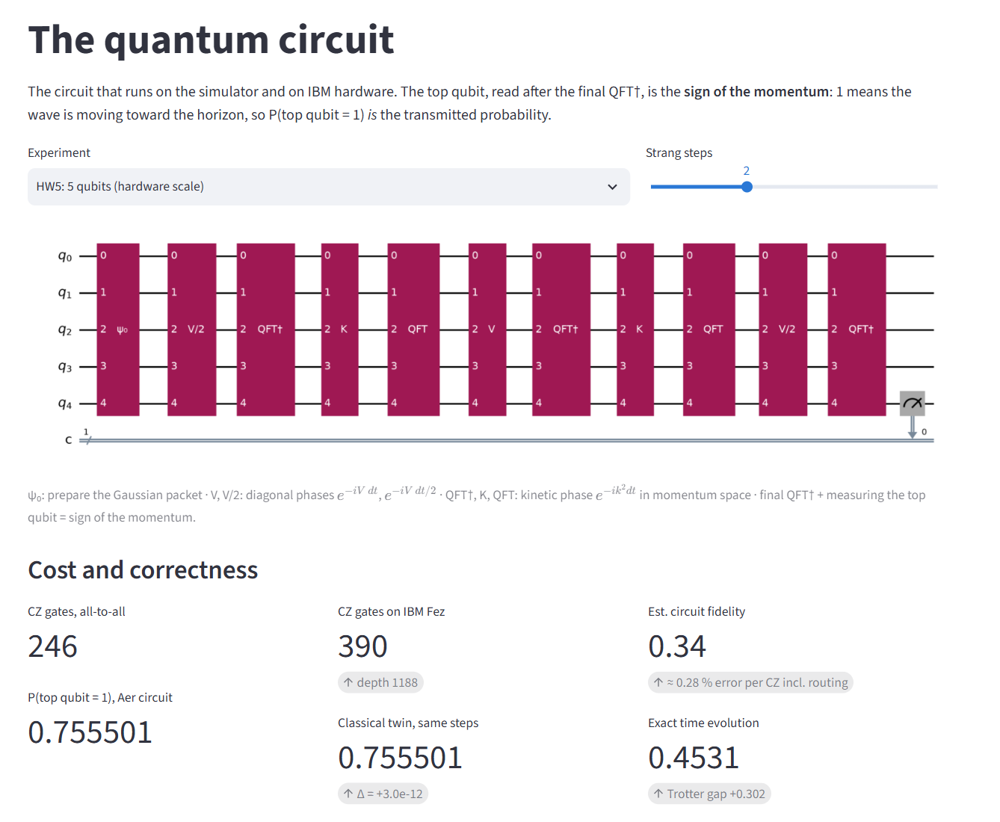<br>
  <sub><b>Circuit.</b> The real Qiskit circuit, its CZ cost on IBM Fez, and a live
  Aer-vs-twin check that agrees to 3 × 10⁻¹².</sub>
</p>

```bash
pip install -e ".[quantum,app]"
streamlit run app/streamlit_app.py
```

A Docker-based Hugging Face Space definition is in [`deploy/hf-space/`](deploy/hf-space/).

## Getting started

**Install** (Python ≥ 3.10):

```bash
git clone https://github.com/hastikacheddy/bhtunnel.git
cd bhtunnel
pip install -r requirements-lock.txt   # exact versions used for the results
pip install -e ".[dev,quantum]"
```

**Test**. The suite covers the physics limits, circuit-vs-twin equivalence and the app:

```bash
pytest -m "not slow"   # about 20 s
pytest                 # full suite, about 2 min
```

**Reproduce the results**

| Script | Produces | Time* |
|---|---|---|
| `scripts/make_reference.py` | `figures/greybody.png`, `hawking_spectrum.png`, `cross_section.png` | ~3 min |
| `scripts/error_budget.py` | `figures/error_budget_*.png` | ~3 min |
| `scripts/resource_study.py` | `figures/resources.png` | ~20 s |
| `scripts/noise_study.py` | `figures/noise.png`, `data/noise.json` | ~1.5 min |
| `scripts/amplitude_estimation.py` | `figures/amplitude_estimation.png` (needs `data/noise.json`) | ~30 s |
| `scripts/vqe_bound_state.py` | `figures/vqe_bound_state.png` | ~2 min |
| `scripts/make_app_tables.py` | greybody tables for the app | ~3 min |
| `scripts/make_readme_figures.py`, `make_readme_screenshots.py` | `docs/images/` | ~1 min |

<sub>*On a 12-core laptop.</sub>

**Run on IBM Quantum.** The script is a dry run on a noisy simulator unless you
pass `--submit`:

```bash
python scripts/run_ibm.py                                # dry run, noisy Aer (FakeFez)
python scripts/run_ibm.py --submit --backend ibm_fez     # uses your saved account and QPU time
python scripts/run_ibm.py --retrieve <job_id>
```

Real runs use the Runtime Estimator with resilience level 2 (TREX + ZNE), gate
and measurement twirling, and XY4 dynamical decoupling.

## Repository structure

```text
src/bhtunnel/
├── schwarzschild.py   potential (incl. mass term), tortoise coordinate, barrier peak
├── greybody.py        exact scattering solver, absorption cross section
├── wkb.py             WKB, low-frequency and photon-sphere approximations
├── hawking.py         emission spectra from greybody factors
├── window.py          finite-support potential and its exact transmission
├── grid.py            classical twin: grid, Walsh tools, split-operator, observables
├── circuits.py        Qiskit circuits, gate-for-gate equal to the twin
├── presets.py         named simulator- and hardware-scale experiments
├── ae.py              Grover operator, MLAE, noise-aware Cramér–Rao cost model
├── bound.py           massive-scalar quasi-bound states
└── data/              precomputed greybody tables (used by the app)
app/                   Streamlit demo
scripts/               one script per study → data/, figures/
tests/                 physics, circuit-equivalence and app tests
notebooks/             results overview for presentations
deploy/hf-space/       Hugging Face Space (Docker)
docs/                  related work, README images
```

## Scope and limitations

- **No quantum advantage is claimed.** The problem is one-dimensional and
  classically easy. The contribution is the cost and error analysis.
- **Hardware results are device benchmarks**, not physics measurements, until
  circuits of thousands of CZ gates run faithfully.
- **The Hawking spectrum is not "simulated".** Only $`\Gamma_l`$ is; the thermal
  factor is analytic.
- **Quasi-bound states are approximated by a Hermitian box**, which captures
  $`\mathrm{Re}\,\omega`$ but not the decay rate.
- **The noise model is global depolarisation**, calibrated on a noisy simulator.
  Real devices also have coherent and correlated errors.

## Roadmap

- [ ] Run [`scripts/run_ibm.py`](scripts/run_ibm.py) on IBM hardware and add the
      measured column to the noise table
- [ ] $`\mathrm{Im}\,\omega`$ of quasi-bound states via Leaver's continued fraction
      or a complex absorbing potential
- [ ] Gray-code synthesis of *truncated* Walsh series, so truncation pays at large $`n`$
- [ ] Reissner–Nordström and Schwarzschild–de Sitter backgrounds
- [ ] Deploy the Hugging Face Space

See [`docs/related_work.md`](docs/related_work.md) for how this sits relative to
prior work.

## Citing

If you use this code, please cite it ([`CITATION.cff`](CITATION.cff)):

```bibtex
@software{cheddy_bhtunnel_2026,
  author  = {Cheddy, Hastika},
  title   = {bhtunnel: Quantum simulation of black-hole greybody factors and Hawking emission},
  year    = {2026},
  version = {0.1.0},
  url     = {https://github.com/hastikacheddy/bhtunnel}
}
```

## License

Apache License 2.0. See [`LICENSE`](LICENSE). Built with
[Qiskit](https://github.com/Qiskit/qiskit), [Qiskit Aer](https://github.com/Qiskit/qiskit-aer)
and [Qiskit IBM Runtime](https://github.com/Qiskit/qiskit-ibm-runtime).
